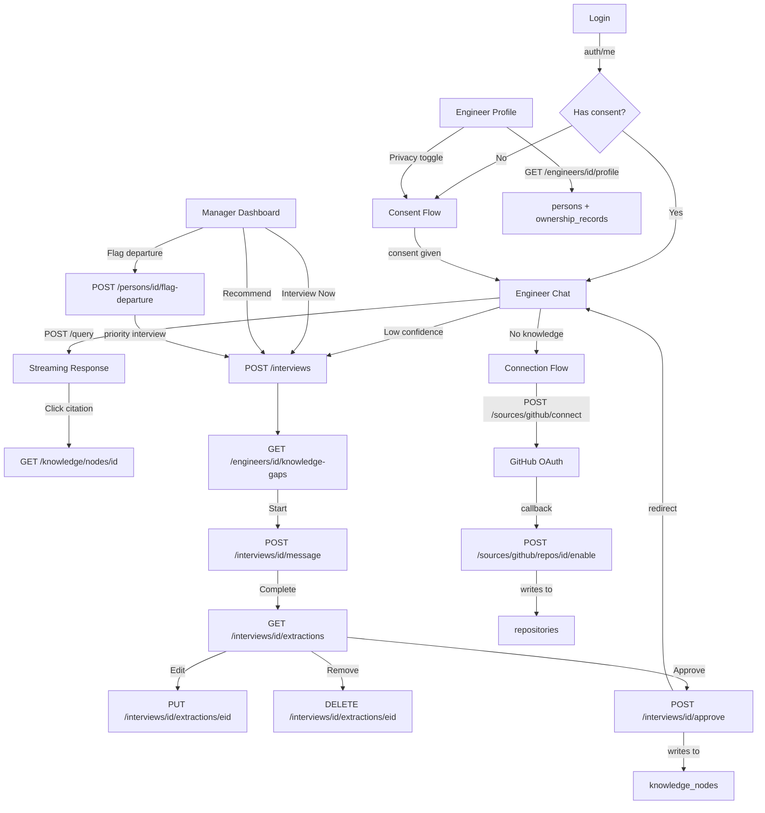

# Screen Flow — ER Diagram + API Endpoints

Strictly follows Michelle's ER diagram and Kamya's API endpoints. Every screen maps to real tables. Every action maps to real endpoints.

---

## ER Tables → Screen Mapping

| ER Table | Screen(s) | Read/Write |
|----------|-----------|------------|
| `persons` | All screens | Read |
| `consent_records` | Consent Flow | Read/Write |
| `interviews` | Interview, Dashboard | Read/Write |
| `interview_targets` | Interview Opening | Read |
| `interview_messages` | Interview Chat | Read/Write |
| `interview_extractions` | Confirmation Screen | Read/Write |
| `knowledge_nodes` | Chat, Confirmation, Knowledge | Read/Write |
| `knowledge_node_embeddings` | (internal — Tansiq retrieval) | — |
| `alternatives_considered` | (linked to knowledge_nodes) | Read |
| `risks_on_decisions` | (linked to knowledge_nodes) | Read |
| `systems` | Dashboard, Engineer Profile, Knowledge | Read |
| `system_components` | (internal — Kaif extraction) | — |
| `system_dependencies` | (linked to knowledge_nodes) | Read |
| `ownership_records` | Engineer Profile | Read |
| `repositories` | Connection Flow | Read |
| `commits` | Engineer Profile, Chat citations | Read |
| `pull_requests` | Engineer Profile, Chat citations | Read |
| `pr_review_comments` | Chat citations | Read |
| `slack_messages` | Chat citations | Read |
| `jira_issues` | Chat citations | Read |
| `teams` | (used in org context) | Read |
| `organizations` | (used in auth context) | Read |
| `event_queue` | (internal — Dolphin pipeline) | — |
| `llm_call_logs` | (internal — logging) | — |
| `staleness_events` | (no API endpoint yet) | — |
| `audit_log` | (no API endpoint yet) | — |
| `incidents` | (no API endpoint yet) | — |

---

## 1. LOGIN

**ER tables:** `organizations`, `persons`
**API endpoints:**
- `POST /auth/login` → JWT access + refresh tokens
- `GET /auth/me` → current user profile + ring level

```
┌──────────────────────────────────────────┐
│  Archaeon                                │
│                                          │
│  Email    [________________________]     │
│  Password [________________________]     │
│                                          │
│            [ Sign In ]                   │
│                                          │
└──────────────────────────────────────────┘
```

| Action | API Call | ER Tables | Result |
|--------|----------|-----------|--------|
| Submit login | `POST /auth/login` | `persons` (auth) | JWT token returned |
| After login | `GET /auth/me` | `persons` | Load user profile, ring level |

---

## 2. CONSENT FLOW

**ER tables:** `persons`, `consent_records`
**API endpoints:**
- `PATCH /persons/{person_id}/consent` → **MISSING FROM API** (gap)
- `GET /persons/{person_id}/data` → **MISSING FROM API** (gap)

### Screen 2a — What We Capture

No API call. Informational only.

```
┌──────────────────────────────────────────────┐
│  Archaeon                                    │
│                                              │
│  Welcome to Archaeon                         │
│                                              │
│  What we capture:                            │
│  - Commits and PRs from connected repos      │
│  - Interview responses                       │
│  - Knowledge you approve                     │
│                                              │
│  What we never capture:                      │
│  - Private messages                          │
│  - Personal accounts                         │
│                                              │
│                              [ Continue ]    │
└──────────────────────────────────────────────┘
```

### Screen 2b — Who Can See It

No API call. Informational only.

```
┌──────────────────────────────────────────────┐
│  Archaeon                                    │
│                                              │
│  Who Can See Your Data                       │
│                                              │
│  Ring 1 (You)      Ring 2 (Team)    Ring 3+  │
│  Your systems      Team health     All teams │
│  Your name         Your name       System    │
│  in attribution    in attribution  health    │
│                                              │
│  Your interview transcript is only           │
│  visible to you. Always.                     │
│                                              │
│                              [ Continue ]    │
└──────────────────────────────────────────────┘
```

### Screen 2c — Your Controls

```
┌──────────────────────────────────────────────┐
│  Archaeon                                    │
│                                              │
│  Your Privacy Controls                       │
│                                              │
│  Passive capture of GitHub     [ ● ON ]     │
│  Interview invitations         [ ● ON ]     │
│  Show name in attribution      [ ● ON ]     │
│                                              │
│  ──────────────────────────────────────────  │
│  View all data stored about you              │
│  Request deletion of your data               │
│                                              │
│                              [ Continue ]    │
└──────────────────────────────────────────────┘
```

| Action | API Call | ER Table | Fields Written |
|--------|----------|----------|----------------|
| Toggle passive capture | `PATCH /persons/{person_id}/consent` | `consent_records` | `passive_capture_consented` |
| Toggle interview invitations | `PATCH /persons/{person_id}/consent` | `consent_records` | `interview_consented` |
| Toggle show name | `PATCH /persons/{person_id}/consent` | `consent_records` | `ring_visibility` |
| View all data | `GET /persons/{person_id}/data` | `persons`, `commits`, `pull_requests`, `interviews` | — |
| Request deletion | (confirmation modal, then API call) | `persons` | `departed_at` |

**Note:** `PATCH /persons/{person_id}/consent` and `GET /persons/{person_id}/data` are not in Kamya's API yet. Flagged as gaps.

### Screen 2d — Confirm

```
┌──────────────────────────────────────────────┐
│  Archaeon                                    │
│                                              │
│  Ready to Start                              │
│                                              │
│  You can change these settings anytime       │
│  in your profile.                            │
│                                              │
│        [ I understand and I consent ]        │
└──────────────────────────────────────────────┘
```

| Action | API Call | ER Table | Fields Written |
|--------|----------|----------|----------------|
| Click consent | `PATCH /persons/{person_id}/consent` | `consent_records` | `consented_at` = now |

---

## 3. CONFIRMATION SCREEN

**ER tables:** `interview_extractions`, `knowledge_nodes`, `interviews`
**API endpoints:**
- `GET /interviews/{interview_id}/extractions` → pending claims
- `PUT /interviews/{interview_id}/extractions/{extraction_id}` → edit a claim
- `DELETE /interviews/{interview_id}/extractions/{extraction_id}` → remove a claim
- `POST /interviews/{interview_id}/approve` → approve claims → writes to `knowledge_nodes`

### Screen 3a — Claim Cards

```
┌──────────────────────────────────────────────────────────────┐
│  Review Knowledge Claims                    Interview #12   │
├──────────────────────────────────────────────────────────────┤
│                                                              │
│  ┌────────────────────────────────────────────────────────┐ │
│  │ DECISION                                               │ │
│  │                                                        │ │
│  │ The payment service retries 3 times because the team   │ │
│  │ decided bounded retries prevent cascading timeouts.    │ │
│  │                                                        │ │
│  │ Rationale: After the Sept 12 incident, analysis showed │ │
│  │ that 5 retries caused 400ms+ cascading delays.         │ │
│  │                                                        │ │
│  │ Source: Interview #12 — Engineer A                     │ │
│  │ Confidence: 0.82                                       │ │
│  │                                                        │ │
│  │  [ Edit ]  [ Remove ]                                  │ │
│  └────────────────────────────────────────────────────────┘ │
│                                                              │
│  ┌────────────────────────────────────────────────────────┐ │
│  │ DEPENDENCY                                             │ │
│  │                                                        │ │
│  │ payment-service depends on Stripe API for all payment  │ │
│  │ processing. No fallback provider exists.               │ │
│  │                                                        │ │
│  │ Source: PR #187 — Engineer B                           │ │
│  │ Confidence: 0.91                                       │ │
│  │                                                        │ │
│  │  [ Edit ]  [ Remove ]                                  │ │
│  └────────────────────────────────────────────────────────┘ │
│                                                              │
│  ──────────────────────────────────────────────────────────  │
│                                                              │
│  [ Approve & Save (2 claims) ]                               │
│                                                              │
│  Only claims you approve enter the knowledge graph.          │
│                                                              │
└──────────────────────────────────────────────────────────────┘
```

| Action | API Call | ER Tables | Result |
|--------|----------|-----------|--------|
| Load claims | `GET /interviews/{id}/extractions` | `interview_extractions` | Render claim cards |
| Edit claim | `PUT /interviews/{id}/extractions/{eid}` | `interview_extractions` | Update `extraction_confidence` |
| Remove claim | `DELETE /interviews/{id}/extractions/{eid}` | `interview_extractions` | Delete row |
| Approve all | `POST /interviews/{id}/approve` | `knowledge_nodes` | Create nodes with `approved_by_person_id`, `approved_at` |

**Data per extraction (from `interview_extractions`):**
- `extraction_confidence` — shown as confidence score
- `node_id` — links to `knowledge_nodes` (created on approve)

**Data per knowledge node (from `knowledge_nodes`):**
- `node_type` — Decision / Dependency / Risk / Process
- `claim_text` — the claim
- `rationale` — why this matters
- `confidence_score` — extraction confidence
- `source_type` — interview / PR / commit
- `source_id` — link to source
- `version_number` — starts at 1
- `approved_by_person_id` — who approved
- `approved_at` — when approved

---

## 4. INTERVIEW

**ER tables:** `interviews`, `interview_targets`, `interview_messages`, `interview_extractions`, `persons`
**API endpoints:**
- `POST /interviews` → create interview
- `GET /interviews/{interview_id}` → interview state + message thread
- `POST /interviews/{interview_id}/message` → send answer, get next question
- `GET /interviews/{interview_id}/extractions` → live knowledge preview

### Screen 4a — Opening

```
┌──────────────────────────────────────────────────────────────┐
│  Knowledge Interview                                         │
├──────────────────────────────────────────────────────────────┤
│                                                              │
│  Interview for: Engineer A                                   │
│  Trigger: gap_score > 0.6                                    │
│                                                              │
│  Systems:                                                    │
│  - payment-service (primary)                                 │
│  - stripe-webhook-handler (secondary)                        │
│                                                              │
│  Knowledge gaps: 8                                           │
│  Estimated time: 15-20 minutes                               │
│                                                              │
│  Nothing is saved until you approve it.                      │
│                                                              │
│                              [ Start Interview ]             │
└──────────────────────────────────────────────────────────────┘
```

| Action | API Call | ER Table | Result |
|--------|----------|----------|--------|
| Load opening | `GET /engineers/{person_id}/knowledge-gaps` | `interview_targets` | Show gap count, systems |
| Start interview | `POST /interviews` | `interviews` | Create row: `trigger_type`, `status` = "in_progress" |

**Interview record fields:**
- `person_id` — who is being interviewed
- `trigger_type` — gap_score / quarterly / departure
- `status` — scheduled / in_progress / completed
- `target_count` — number of gaps to address
- `targets_addressed` — updated as questions are answered

### Screen 4b — Question (Split View)

```
┌────────────────────────────────────────────────────────────────────────┐
│  Question 3 of 8                          [ Skip ]                    │
├──────────────────────────────────┬─────────────────────────────────────┤
│                                  │                                     │
│  About payment-service,          │  Live Knowledge Preview             │
│  September 2025.                 │  ─────────────────────────         │
│                                  │                                     │
│  Why did the team choose 3       │  ┌───────────────────────────┐    │
│  retries instead of 5 or 1?      │  │ ✅ Decision Node           │    │
│                                  │  │ Confidence: 0.82           │    │
│  ┌────────────────────────────┐ │  └───────────────────────────┘    │
│  │                            │ │                                     │
│  │  (type answer here)        │ │  ┌───────────────────────────┐    │
│  │                            │ │  │ ⏳ Pending                 │    │
│  └────────────────────────────┘ │  │ Confidence: 0.68           │    │
│                                  │  └───────────────────────────┘    │
│       [ Submit Answer ]          │                                     │
│                                  │  3 nodes captured                   │
├──────────────────────────────────┴─────────────────────────────────────┤
│  ████████████░░░░░░░░  3 of 8 gaps addressed                          │
└────────────────────────────────────────────────────────────────────────┘
```

| Action | API Call | ER Table | Result |
|--------|----------|----------|--------|
| Load interview | `GET /interviews/{id}` | `interviews`, `interview_messages` | Message thread, status |
| Submit answer | `POST /interviews/{id}/message` | `interview_messages` | Add message (role=engineer), get next question |
| Load extractions | `GET /interviews/{id}/extractions` | `interview_extractions` | Live preview of claims |
| Skip question | `POST /interviews/{id}/message` | `interview_messages` | Skip flag, next question |

**Message fields (from `interview_messages`):**
- `role` — "interviewer" or "engineer"
- `content` — message text
- `sent_at` — timestamp
- `referenced_artifacts` — links to PRs, commits, etc.

**Progress calculation:**
- `targets_addressed` / `target_count` from `interviews` table

### Screen 4c — Completion

```
┌──────────────────────────────────────────────────────────────┐
│  Interview Complete                                          │
├──────────────────────────────────────────────────────────────┤
│                                                              │
│  Claims extracted: 5                                         │
│  Systems covered: 3                                          │
│  Time: 8 minutes                                             │
│                                                              │
│  Nothing is saved yet. Review each claim before approving.   │
│                                                              │
│              [ Review & Approve ]                            │
└──────────────────────────────────────────────────────────────┘
```

| Action | API Call | ER Table | Result |
|--------|----------|----------|--------|
| Load summary | `GET /interviews/{id}` | `interviews` | `target_count`, `targets_addressed` |
| Review & Approve | `GET /interviews/{id}/extractions` | `interview_extractions` | Redirect to Confirmation Screen |

---

## 5. ENGINEER CHAT

**ER tables:** `knowledge_nodes`, `knowledge_node_embeddings` (internal), `systems`, `commits`, `pull_requests`
**API endpoints:**
- `POST /query` → conversational Q&A with citations
- `GET /knowledge/nodes/{node_id}` → citation detail

### Screen 5a — Chat

```
┌──────────────────────────────────────────────────────────────────────────┐
│  Archaeon                                        [ Engineer A ▾ ]       │
├──────────────────────────────────────────────────────────────────────────┤
│                                                                          │
│  Previous Q&A (scrollable)                                              │
│                                                                          │
│  ──────────────────────────────────────────────────────────────────────  │
│                                                                          │
│  ┌────────────────────────────────────────────────────────────────┐     │
│  │ HIGH CONFIDENCE                                                │     │
│  │                                                                │     │
│  │ The payment service retries 3 times because the team decided   │     │
│  │ bounded retries prevent cascading timeouts while still         │     │
│  │ handling transient failures [Decision: PR #142].               │     │
│  │                                                                │     │
│  │ The team considered 5 retries but settled on 3 to avoid        │     │
│  │ cascading timeouts [Interview: Engineer, Q3 2025].             │     │
│  └────────────────────────────────────────────────────────────────┘     │
│                                                                          │
│  ┌──────────────┐ ┌──────────────────────┐ ┌────────────────────┐      │
│  │ Decision     │ │ System:              │ │ Interview:         │      │
│  │ PR #142      │ │ payment-service      │ │ Engineer, Q3 2025  │      │
│  └──────────────┘ └──────────────────────┘ └────────────────────┘      │
│                                                                          │
│  ──────────────────────────────────────────────────────────────────────  │
│                                                                          │
│  ┌────────────────────────────────────────────────────────────────┐     │
│  │ Ask anything about your codebase...                             │     │
│  └────────────────────────────────────────────────────────────────┘     │
│                                                              Ctrl+Enter │
└──────────────────────────────────────────────────────────────────────────┘
```

| Action | API Call | ER Table | Result |
|--------|----------|----------|--------|
| Submit question | `POST /query` | `knowledge_nodes` (via retrieval) | Streaming response with citations |
| Click citation | `GET /knowledge/nodes/{node_id}` | `knowledge_nodes` | Side panel with full detail |

**Response data (from `POST /query`):**
- Answer text (streamed token-by-token)
- Confidence level
- Citation list: each citation links to a `knowledge_nodes` record

**Citation detail (from `GET /knowledge/nodes/{node_id}`):**
- `claim_text` — the knowledge claim
- `rationale` — why this matters
- `confidence_score` — how confident
- `node_type` — Decision / Dependency / Risk / Process
- `source_type` — interview / PR / commit
- `source_id` — link to source
- `approved_by_person_id` — who approved
- `approved_at` — when approved

### Screen 5b — Citation Side Panel

```
┌──────────────────────────────────────┐
│  Decision Node #142                  │
│  ─────────────────────               │
│                                      │
│  Claim: Use 3 retries for Stripe     │
│  webhook to handle transient...      │
│                                      │
│  Rationale: Transient failures need  │
│  bounded retries to avoid cascade... │
│                                      │
│  Confidence: 0.82                    │
│  Type: Decision                      │
│  Source: PR #142                     │
│  Approved by: Engineer A             │
│  Approved at: 2025-09-15             │
│                                      │
│  [ View on GitHub ]                  │
└──────────────────────────────────────┘
```

### Screen 5c — Low Confidence

```
┌──────────────────────────────────────────────────────────────┐
│  LOW CONFIDENCE                                              │
│                                                              │
│  Limited information found.                                  │
│                                                              │
│  Schedule an interview to capture this knowledge.            │
│                                                              │
│  [ Request Interview ]                                       │
└──────────────────────────────────────────────────────────────┘
```

| Action | API Call | ER Table | Result |
|--------|----------|----------|--------|
| Request Interview | `POST /interviews` | `interviews` | Create interview, redirect to Interview |

### Screen 5d — No Knowledge

```
┌──────────────────────────────────────────────────────────────┐
│  No Knowledge Found                                          │
│                                                              │
│  Nothing matched your question.                              │
│                                                              │
│  [ Schedule Interview ]  [ Connect Repo ]                    │
└──────────────────────────────────────────────────────────────┘
```

| Action | API Call | ER Table | Result |
|--------|----------|----------|--------|
| Schedule Interview | `POST /interviews` | `interviews` | Create interview, redirect |
| Connect Repo | (navigation) | — | Redirect to Connection Flow |

---

## 6. MANAGER DASHBOARD

**ER tables:** `systems`, `ownership_records`, `knowledge_nodes`, `persons`, `interviews`
**API endpoints (all require Ring 3+):**
- `GET /dashboard/knowledge-health` → coverage scores by system
- `GET /dashboard/bus-factor` → engineers who are single points of failure
- `GET /dashboard/stale-knowledge` → systems with decayed confidence
- `GET /dashboard/interview-recommendations` → auto-generated recommendations
- `POST /persons/{person_id}/flag-departure` → mark engineer as departing

### Screen 6a — Dashboard

```
┌──────────────────────────────────────────────────────────────────────────────┐
│  Manager Dashboard                                   Domain: [ Backend ▾ ]  │
├──────────────────────────────────────────────────────────────────────────────┤
│                                                                              │
│  KNOWLEDGE HEALTH                                                            │
│  ┌─────────────────┐ ┌─────────────────┐ ┌─────────────────┐               │
│  │ payment-service │ │ auth-service    │ │ user-mgmt       │               │
│  │ ████████░░ 78%  │ │ ██████████ 95%  │ │ █████░░░░ 52%   │               │
│  │ 2 owners        │ │ 3 owners        │ │ 1 owner ⚠       │               │
│  │ Updated 2d ago  │ │ Updated 1w ago  │ │ Updated 30d ago │               │
│  └─────────────────┘ └─────────────────┘ └─────────────────┘               │
│                                                                              │
│  BUS FACTOR RISK                    STALE KNOWLEDGE                          │
│  ┌───────────────────────────┐     ┌───────────────────────────┐           │
│  │ Engineer A                │     │ user-mgmt                  │           │
│  │ Sole expert: payment-svc  │     │ 4 stale nodes (30d)        │           │
│  │ Tenure: 2.1 years         │     │ [ Recommend Interview ]    │           │
│  │ [ Interview Now ]         │     │                            │           │
│  │                           │     │ notification-svc           │           │
│  │ Engineer B                │     │ 6 stale nodes (45d)        │           │
│  │ Sole expert: notif-svc    │     │ [ Recommend Interview ]    │           │
│  │ Tenure: 8 months          │     │                            │           │
│  │ [ Interview Now ]         │     │                            │           │
│  └───────────────────────────┘     └───────────────────────────┘           │
│                                                                              │
│  INTERVIEW QUEUE                                                             │
│  Engineer A    Gap score > 0.6   auth-service     [ Send ]  [ Dismiss ]    │
│  Engineer B    Quarterly         user-mgmt        [ Send ]  [ Dismiss ]    │
│  Engineer C    Departure flagged payment-svc      [ Priority ]              │
│                                                                              │
│  DEPARTURE FLOW                                                              │
│  Search: [______________]  [ Mark as Departing ]                            │
│                                                                              │
└──────────────────────────────────────────────────────────────────────────────┘
```

| Section | Action | API Call | ER Table | Result |
|---------|--------|----------|----------|--------|
| Knowledge Health | Load | `GET /dashboard/knowledge-health` | `systems`, `ownership_records` | Render coverage bars |
| Knowledge Health | Click system | `GET /knowledge/systems/{system_id}` | `systems`, `ownership_records` | System detail view |
| Bus Factor | Load | `GET /dashboard/bus-factor` | `persons`, `ownership_records` | Render engineer rows |
| Bus Factor | Interview Now | `POST /interviews` | `interviews` | Create interview, redirect |
| Stale Knowledge | Load | `GET /dashboard/stale-knowledge` | `knowledge_nodes` | Render stale systems |
| Stale Knowledge | Recommend Interview | `POST /interviews` | `interviews` | Create interview |
| Interview Queue | Load | `GET /dashboard/interview-recommendations` | `interviews`, `persons` | Render queue |
| Interview Queue | Send | `POST /interviews` | `interviews` | Send invite |
| Interview Queue | Dismiss | (local state) | — | Remove from view |
| Interview Queue | Priority | `POST /persons/{id}/flag-departure` | `persons`, `interviews` | Flag departure, priority interview |
| Departure Flow | Search | `GET /engineers?q=` | `persons` | Search results |
| Departure Flow | Mark Departing | `POST /persons/{id}/flag-departure` | `persons` | `departed_at` set |

**Data from `GET /dashboard/knowledge-health`:**
- System name, coverage score (`knowledge_coverage_score`), owner count, last updated

**Data from `GET /dashboard/bus-factor`:**
- Engineer name, system, ownership percentage, tenure

**Data from `GET /dashboard/stale-knowledge`:**
- System name, stale node count, days since update

**Data from `GET /dashboard/interview-recommendations`:**
- Engineer name, trigger type, target systems

---

## 7. CONNECTION FLOW

**ER tables:** `repositories`
**API endpoints:**
- `POST /sources/github/connect` → OAuth flow
- `GET /sources/github/repos` → list available repos
- `POST /sources/github/repos/{repo_id}/enable` → start ingestion
- `POST /sources/slack/connect` → Slack OAuth
- `GET /sources/status` → sync status

### Screen 7a — Tool Cards

```
┌──────────────────────────────────────────────────────────────┐
│  Connect Data Sources                                        │
├──────────────────────────────────────────────────────────────┤
│                                                              │
│  ┌─────────────┐ ┌─────────────┐ ┌─────────────┐           │
│  │   GitHub    │ │   Slack     │ │   Jira      │           │
│  │ Connected ✓ │ │ Connected ✓ │ │ Not yet     │           │
│  │ 3 repos     │ │ 12 channels │ │ [ Connect ] │           │
│  │ [ Manage ]  │ │ [ Manage ]  │ │             │           │
│  └─────────────┘ └─────────────┘ └─────────────┘           │
│                                                              │
│  Sync Status:                                                │
│  GitHub — Last synced: 2h ago │ 47 events                   │
│  Slack  — Last synced: 15m ago │ 203 messages               │
│                                                              │
└──────────────────────────────────────────────────────────────┘
```

| Action | API Call | ER Table | Result |
|--------|----------|----------|--------|
| Load status | `GET /sources/status` | `repositories` | Render sync status |
| Connect GitHub | `POST /sources/github/connect` | `repositories` | OAuth redirect |
| List repos | `GET /sources/github/repos` | `repositories` | Checkbox list |
| Enable repo | `POST /sources/github/repos/{repo_id}/enable` | `repositories` | Start ingestion, `connected_at` set |
| Connect Slack | `POST /sources/slack/connect` | (slack channels) | OAuth redirect |

**Repository fields (from `repositories`):**
- `github_repo_id` — external ID
- `name` — repo name
- `full_name` — owner/repo
- `default_branch` — main branch
- `connected_at` — when connected
- `last_synced_at` — last sync time

---

## 8. ENGINEER PROFILE

**ER tables:** `persons`, `ownership_records`, `knowledge_nodes`, `interviews`, `commits`, `pull_requests`
**API endpoints:**
- `GET /engineers/{person_id}/profile` → systems, commits, PRs, gap score
- `GET /engineers/{person_id}/interviews` → interview history
- `GET /engineers/{person_id}/knowledge-gaps` → gap targets

### Screen 8a — Profile

```
┌──────────────────────────────────────────────────────────────┐
│  My Profile                                                  │
├──────────────────────────────────────────────────────────────┤
│                                                              │
│  Engineer A — Backend Team                                   │
│  Ring Level: 2                                               │
│  Tenure: 2.1 years                                           │
│  Joined: March 2024                                          │
│                                                              │
│  MY SYSTEMS                                                  │
│  System              Ownership    Knowledge    Actions       │
│  payment-service     85%          78%          [ View ]      │
│  stripe-webhook      40%          62%          [ View ]      │
│                                                              │
│  MY ATTRIBUTED KNOWLEDGE                                     │
│  5 decisions attributed to you                               │
│  3 risks identified                                          │
│  2 dependencies documented                                   │
│  Last interview: Sept 15, 2025                               │
│                                                              │
│  PRIVACY SETTINGS                                            │
│  Passive capture             [ ● ON ]                        │
│  Interview invitations       [ ● ON ]                        │
│  Show name in attribution    [ ● ON ]                        │
│                                                              │
│  View all data stored about me                               │
│  Request deletion of my data                                 │
│                                                              │
└──────────────────────────────────────────────────────────────┘
```

| Section | Action | API Call | ER Table | Result |
|---------|--------|----------|----------|--------|
| Header | Load | `GET /engineers/{person_id}/profile` | `persons` | Name, ring, tenure |
| My Systems | Load | `GET /engineers/{person_id}/profile` | `ownership_records`, `systems` | System list with ownership % |
| My Systems | View | `GET /knowledge/systems/{system_id}` | `systems`, `knowledge_nodes` | System detail |
| Attributed Knowledge | Load | `GET /engineers/{person_id}/profile` | `knowledge_nodes` (via attribution) | Count of decisions, risks, dependencies |
| Interview History | Load | `GET /engineers/{person_id}/interviews` | `interviews` | Last interview date |
| Privacy Settings | Toggle | `PATCH /persons/{person_id}/consent` | `consent_records` | Update preference |
| View all data | Click | `GET /persons/{person_id}/data` | `persons`, `commits`, `pull_requests`, `interviews` | Data viewer |
| Request deletion | Click | (confirmation modal) | `persons` | Deletion request |

---

## API DEPENDENCIES

### Endpoints That Exist (✅)

| Endpoint | Used By |
|----------|---------|
| `POST /auth/login` | Login |
| `GET /auth/me` | Login |
| `GET /knowledge/systems` | Dashboard, Profile |
| `GET /knowledge/systems/{system_id}` | Dashboard, Profile |
| `GET /knowledge/nodes/{node_id}` | Chat citations |
| `PATCH /knowledge/nodes/{node_id}` | (admin edit) |
| `GET /engineers/{person_id}/profile` | Profile |
| `GET /engineers/{person_id}/knowledge-gaps` | Interview opening |
| `GET /engineers/{person_id}/interviews` | Profile |
| `POST /interviews` | Interview, Dashboard, Chat |
| `GET /interviews/{id}` | Interview |
| `POST /interviews/{id}/message` | Interview |
| `GET /interviews/{id}/extractions` | Confirmation, Interview |
| `POST /interviews/{id}/approve` | Confirmation |
| `PUT /interviews/{id}/extractions/{eid}` | Confirmation |
| `DELETE /interviews/{id}/extractions/{eid}` | Confirmation |
| `GET /dashboard/knowledge-health` | Dashboard |
| `GET /dashboard/bus-factor` | Dashboard |
| `GET /dashboard/stale-knowledge` | Dashboard |
| `GET /dashboard/interview-recommendations` | Dashboard |
| `POST /persons/{id}/flag-departure` | Dashboard |
| `POST /query` | Chat |
| `POST /sources/github/connect` | Connection |
| `GET /sources/github/repos` | Connection |
| `POST /sources/github/repos/{id}/enable` | Connection |
| `POST /sources/slack/connect` | Connection |
| `GET /sources/status` | Connection |

### Endpoints Missing (❌)

| Endpoint | Used By | Impact |
|----------|---------|--------|
| `PATCH /persons/{person_id}/consent` | Consent Flow, Profile | **Blocks consent flow** |
| `GET /persons/{person_id}/data` | Consent Flow, Profile | **Blocks data viewer** |

### ER Tables With No API Endpoint

| Table | Notes |
|-------|-------|
| `staleness_events` | Dashboard shows stale knowledge but no detailed timeline |
| `audit_log` | No activity log in UI |
| `incidents` | No incident history in UI |
| `alternatives_considered` | Linked to knowledge_nodes, accessible via node detail |
| `risks_on_decisions` | Linked to knowledge_nodes, accessible via node detail |

---

## CROSS-SCREEN FLOW



---

*This document strictly follows Michelle's ER diagram and Kamya's API endpoints. No assumptions. No gaps fabricated.*
