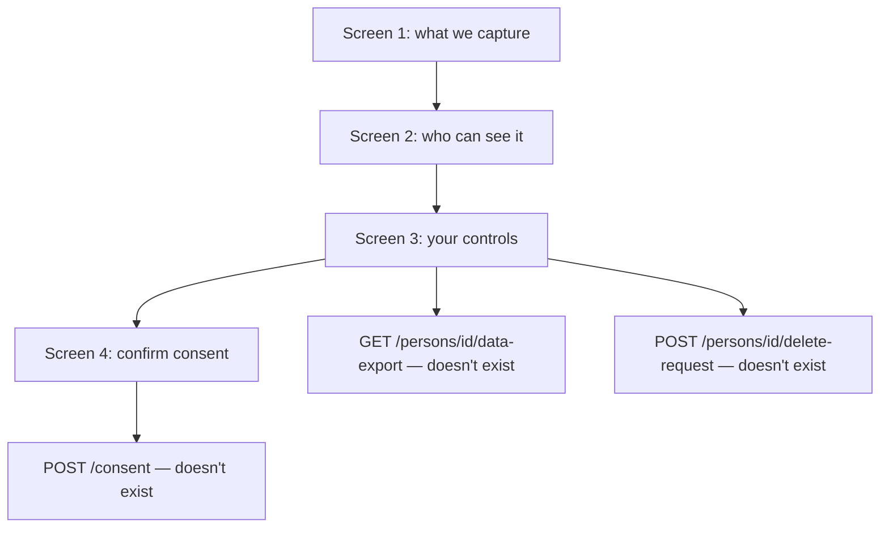
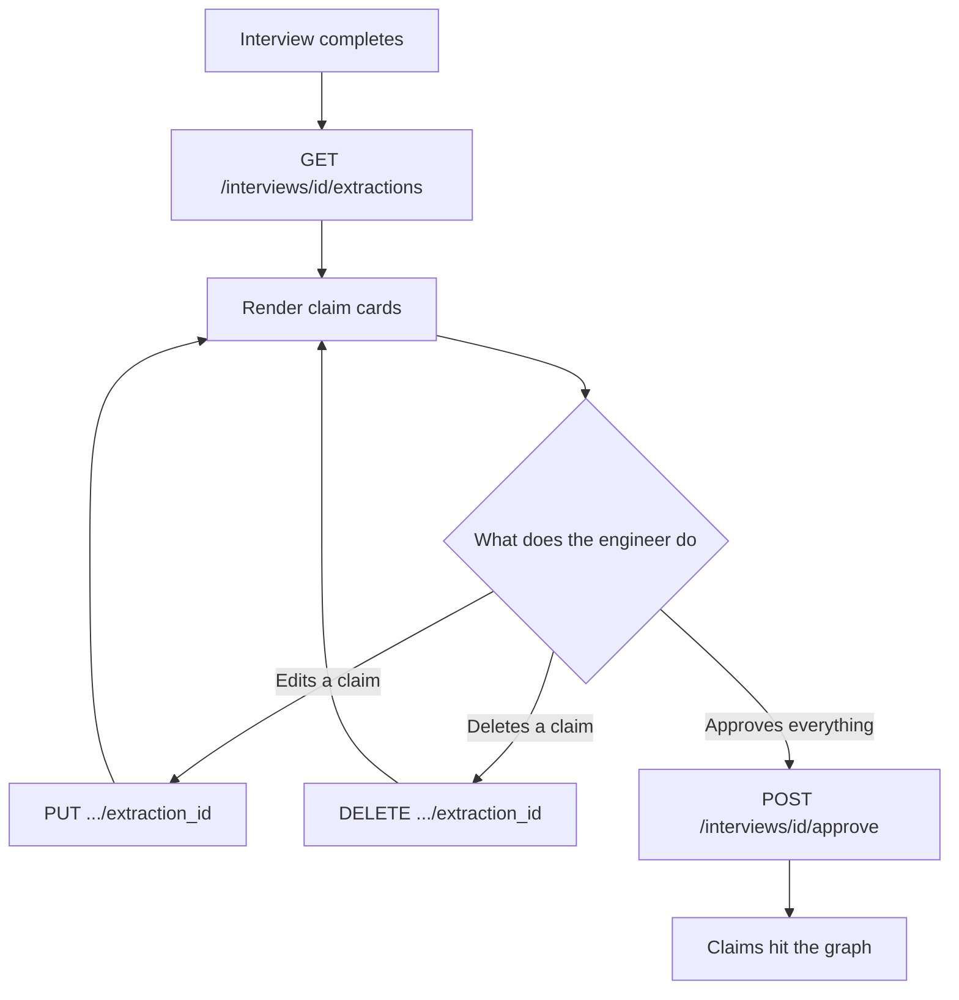
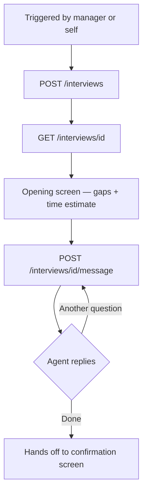
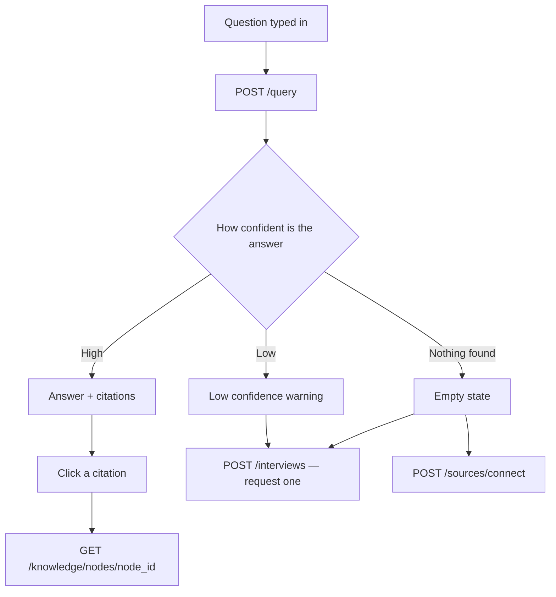
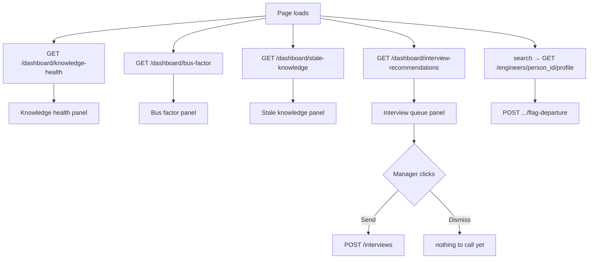
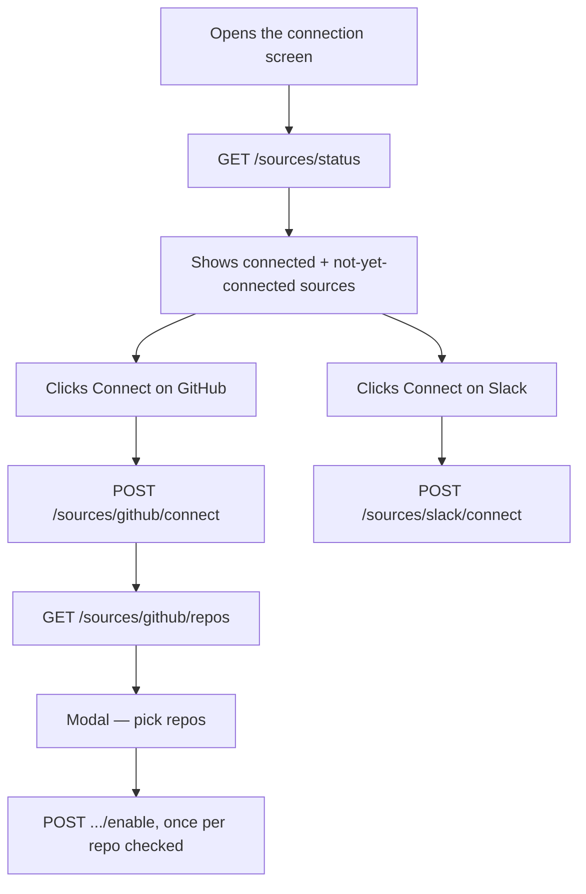
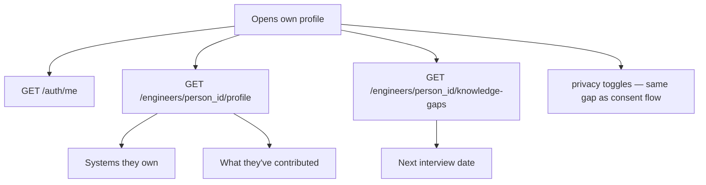

# Screen → API flow

Went through Abhay's wireframes screen by screen and matched each one against what we actually have in the API. Most of it lines up. A few things don't and have flagged them.

If something here looks wrong... Ping me, I'll fix the diagram, not a big deal.

Viewing note: these flow charts will render automatically as actual diagrams on github.com — open the file there, not as a raw text view. If you're reading this in something that doesn't render Mermaid (plain text editor, VS Code without the Mermaid extension), paste the code block into mermaid.live instead.

---

## Consent flow

This is the one to read first.

There's no endpoint for any of this. just not there. 

---

## Confirmation screen

The claim review step after an interview wraps up.

This one's fine. Nothing writes to the graph until approve is hit, which is how it should work don't let anyone "optimize" that away later.

---

## Interview interface

Straightforward. The live knowledge preview on the side panel is just reading the same interview state as it updates, nothing new needed there.

---

## Engineer chat

---

## Manager dashboard

Four panels, four GETs, easy. The dismiss button is the only loose end .. so it'll just pop back up next time the page loads. Might be fine for a first pass, might annoy a manager who dismissed the same thing three times this week. Worth a quick decision, not a big lift either way.

---

## Connection flow

This is two calls back to back, not one — connect first to get the repo list, then enable gets called per checkbox. Should double check with Abhay that's actually how he's wiring the modal's submit button, since it's easy to assume one call does both.

---

## Engineer profile

Same missing-endpoint problem as the consent screens, just showing up again here. Not repeating myself on the details, see above.

---

## What's actually unresolved

- Consent / export / delete — no backend at all
- Chat streaming vs simulated reveal — Abhay's call, needs an answer either way
- Dashboard dismiss — low priority but should be decided, not just left
- Connection flow's two-step OAuth — probably fine, just want Abhay to confirm
