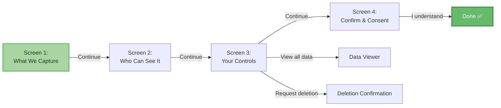
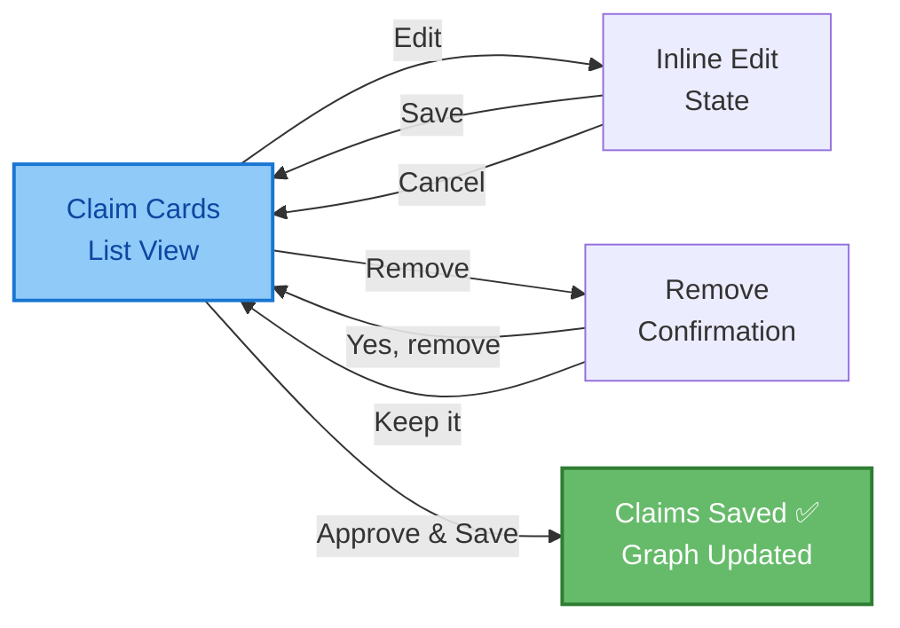
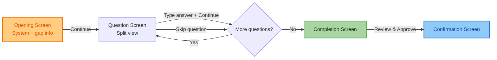
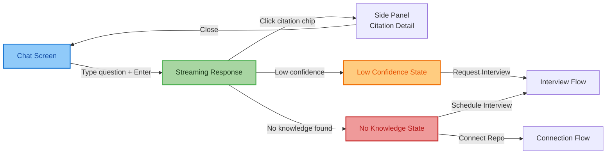
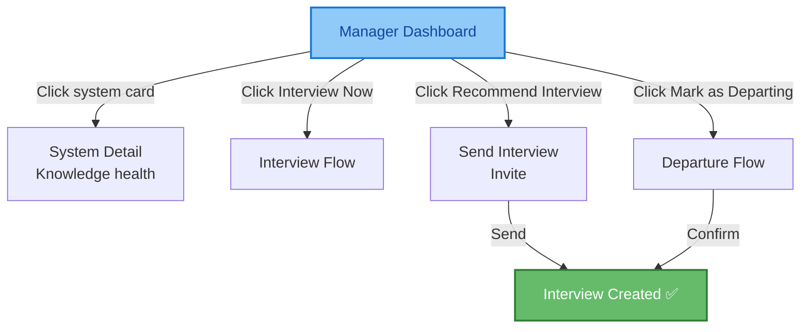
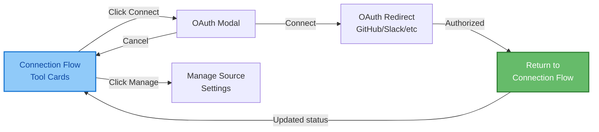
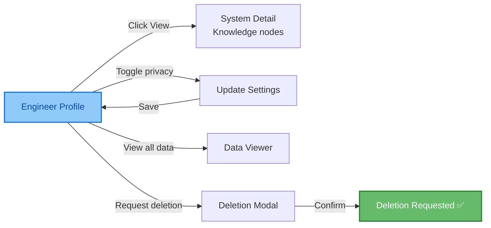
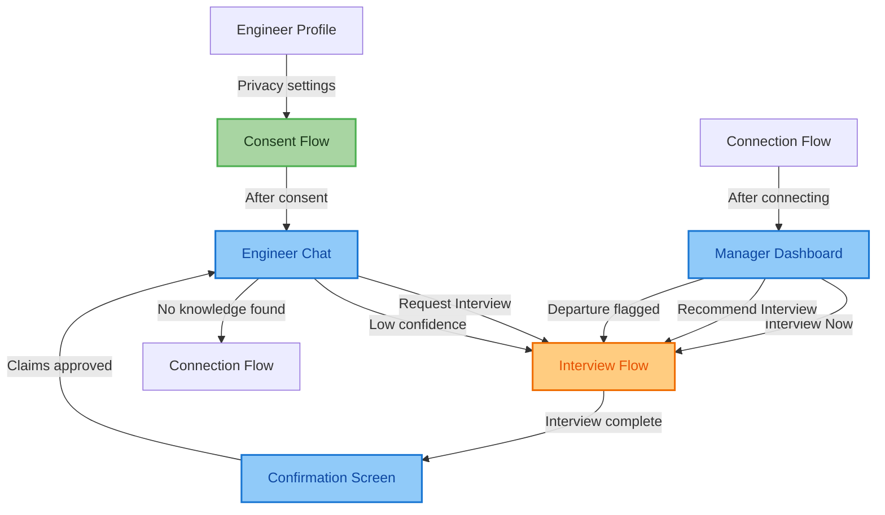

# Screen Flow Diagram — Archaeon Frontend

---

## How to Read This Document

Each interface has:
1. **Mermaid flowchart** — visual overview of screen transitions
2. **Screen detail blocks** — every button, every action, every API call, every edge case

Open this file in VS Code and press `Ctrl+Shift+V` to preview Mermaid diagrams.

---

## 1. CONSENT FLOW

**Priority:** FIRST — blocks everything else
**Rule:** No back navigation. Four sequential screens.
**API Gap:** `PATCH /persons/{person_id}/consent` missing from Kamya's API.

### Screen 1 — What Archaeon Captures

**Purpose:** Inform the engineer what data is collected and what is NOT.
**No API call.** Pure informational screen.

| Button | Action | API Call | Next Screen |
|--------|--------|----------|-------------|
| Continue → | Advance to Screen 2 | None | Screen 2 — Who Can See It |

**No other interactive elements.** This screen is read-only.

---

### Screen 2 — Who Can See It

**Purpose:** Explain ring-based visibility (Ring 1, 2, 3).
**No API call.** Pure informational screen.

| Button | Action | API Call | Next Screen |
|--------|--------|----------|-------------|
| Continue → | Advance to Screen 3 | None | Screen 3 — Your Controls |

**No other interactive elements.** This screen is read-only.

---

### Screen 3 — Your Controls

**Purpose:** Let the engineer set privacy preferences.
**API call needed on Continue.**

| Element | Action | API Call | Result |
|---------|--------|----------|--------|
| Toggle: Passive capture of GitHub contributions | Toggle ON/OFF | `PATCH /persons/{person_id}/consent` | Update preference |
| Toggle: Allow interview invitations | Toggle ON/OFF | `PATCH /persons/{person_id}/consent` | Update preference |
| Toggle: Show name in knowledge attribution | Toggle ON/OFF | `PATCH /persons/{person_id}/consent` | Update preference |
| Link: View all data stored about you | Open data viewer | `GET /persons/{person_id}/data` | Data Viewer panel/page |
| Link: Request deletion of your data | Open deletion confirmation | None (confirmation modal) | Deletion Confirmation modal |
| Continue → | Save preferences, advance to Screen 4 | `PATCH /persons/{person_id}/consent` | Screen 4 — Confirm |

**Edge cases:**
- If API fails on toggle → show inline error, don't block navigation
- If engineer has already consented → skip to Screen 4 (or show as read-only)

---

### Screen 4 — Confirm & Consent

**Purpose:** Final consent confirmation. Engineer must explicitly agree.
**API call on consent.**

| Button | Action | API Call | Result |
|--------|--------|----------|--------|
| I understand and I consent | Record consent, complete onboarding | `PATCH /persons/{person_id}/consent` | Redirect to Engineer Chat (main app) |

**Edge cases:**
- Button disabled until engineer clicks it (no accidental clicks)
- If API fails → show error, allow retry
- After consent → redirect to `/chat` (main interface)

---

## 2. CONFIRMATION SCREEN

**Purpose:** Engineer reviews extracted knowledge claims before they enter the graph.
**Rule:** ONLY way data enters the knowledge graph. Nothing saved until engineer approves.
**Build priority:** SECOND — must be live before interview data enters graph.

### Main Screen — Claim Cards

**Purpose:** Show all extracted claims from an interview. Engineer reviews each.

| Element | Action | API Call | Result |
|---------|--------|----------|--------|
| Claim card | Display claim text, source, confidence | `GET /interviews/{id}/extractions` | Render cards |
| Edit button (per card) | Switch to inline edit mode | None (UI state change) | Card becomes editable |
| Remove button (per card) | Show removal confirmation popup | None (UI state change) | Popup appears |
| Approve & Save button | Approve all visible claims | `POST /interviews/{id}/approve` | Claims written to graph, redirect to Engineer Chat |

**Data displayed per card:**
- Claim type badge (Decision / Dependency / Risk / Process)
- Claim text
- Rationale
- Source (interview, PR, commit)
- Confidence score (color-coded: green ≥0.7, amber 0.4-0.7, red <0.4)

---

### Inline Edit State

**Purpose:** Engineer corrects or refines a claim before approving.

| Button | Action | API Call | Result |
|--------|--------|----------|--------|
| Save | Save edited claim | `PUT /interviews/{id}/extractions/{extraction_id}` | Return to card list with updated text |
| Cancel | Discard edits | None | Return to card list, no change |

**Edge cases:**
- Empty text → Save button disabled
- API fails on save → show inline error, stay in edit mode

---

### Remove Confirmation Popup

**Purpose:** Prevent accidental claim removal.

| Button | Action | API Call | Result |
|--------|--------|----------|--------|
| Yes, remove it | Remove claim from queue | `DELETE /interviews/{id}/extractions/{extraction_id}` | Card disappears from list |
| Keep it | Close popup | None | Return to card list |

**Edge cases:**
- If last claim is removed → show "No claims to approve" empty state
- Approve & Save button count updates dynamically (e.g., "Approve & Save (2 claims)")

---

## 3. INTERVIEW INTERFACE

**Purpose:** Focused, respectful conversation. One question at a time. Engineer sees knowledge being built in real time.

### Screen 1 — Opening

**Purpose:** Set expectations. Show what systems are covered, how many gaps, estimated time.
**API call on load.**

| Button | Action | API Call | Result |
|--------|--------|----------|--------|
| Continue → | Start interview | `POST /interviews` (if not already created) | Screen 2 — Question |

**Data loaded on screen:**
- Systems covered (primary, secondary)
- Number of knowledge gaps identified
- Estimated time
- Reminder: "You can skip any question. Nothing is saved until you approve."

---

### Screen 2 — Question (Split View)

**Purpose:** One question at a time. Left: question + answer input. Right: live knowledge preview.

| Element | Action | API Call | Result |
|---------|--------|----------|--------|
| Skip this question | Skip current question | `POST /interviews/{id}/message` (with skip flag) | Next question or completion |
| Text area | Type answer | None (local state) | Text expands as you type |
| Continue → | Submit answer | `POST /interviews/{id}/message` | Next question or completion |
| Knowledge preview panel | Show claims extracted in real time | `GET /interviews/{id}/extractions` | Updated claim cards |
| Progress bar | Show progress (e.g., "3 of 8 gaps addressed") | Derived from answers submitted | Visual progress |

**Streaming behavior:**
- After submitting answer, the next question should appear via streaming (SSE/chunks)
- Knowledge preview updates as new claims are extracted

**Edge cases:**
- Empty answer → Continue button disabled
- API fails → show error, allow retry
- Network timeout → show "Still processing..." with retry option

---

### Screen 3 — Completion

**Purpose:** Interview done. Summary of what was captured. Next step: review claims.

| Button | Action | API Call | Result |
|--------|--------|----------|--------|
| Review & Approve → | Go to confirmation screen | `GET /interviews/{id}/extractions` | Confirmation Screen (Section 2) |

**Data displayed:**
- Number of knowledge claims extracted
- Number of systems covered
- Total interview time
- Reminder: "Nothing is saved yet."

---

## 4. ENGINEER CHAT

**Purpose:** Most-used interface. Feels like messaging a knowledgeable colleague.
**Streaming:** Response streams token-by-token (critical UX requirement).

### Main Chat Screen

**Purpose:** Ask questions, get grounded answers with citations.

| Element | Action | API Call | Result |
|---------|--------|----------|--------|
| Input field | Type question | None (local state) | Text appears |
| Send (Enter / Ctrl+Enter) | Submit question | `POST /query` | Streaming response appears |
| Citation chip (per citation) | Open side panel with source detail | `GET /knowledge/nodes/{node_id}` | Side panel slides in |
| Previous Q&A | Scrollable history | None (local state) | Scroll up |

**Streaming behavior:**
- Response appears token-by-token
- Confidence badge updates as answer builds
- Citation chips appear as sources are referenced

**Response states:**
- High confidence (green badge) — answer well-sourced
- Medium confidence (amber badge) — partial sources
- Low confidence (orange badge) — limited info, suggest interview
- No knowledge found — suggest interview or repo connection

---

### Citation Side Panel (slides in from right)

**Purpose:** Show the full source behind a citation.

| Element | Action | API Call | Result |
|---------|--------|----------|--------|
| Citation detail | Display claim, rationale, confidence, source | `GET /knowledge/nodes/{node_id}` | Rendered detail |
| View PR on GitHub → | Open GitHub PR in new tab | None (external link) | New browser tab |
| Close (X or click outside) | Close panel | None | Panel slides out |

**Data displayed:**
- Claim text
- Rationale
- Confidence score
- Source (PR, interview, commit)
- Captured date
- Attributed to (engineer name + team)

---

### Low Confidence State

**Purpose:** When the system can't find good answers, suggest capturing that knowledge.

| Button | Action | API Call | Result |
|--------|--------|----------|--------|
| Request Interview → | Create interview for the relevant engineer | `POST /interviews` | Redirect to Interview Flow |

---

### No Knowledge Found State

**Purpose:** Zero matches. Suggest concrete next steps.

| Button | Action | API Call | Result |
|--------|--------|----------|--------|
| Schedule Interview → | Create interview | `POST /interviews` | Redirect to Interview Flow |
| Connect Repo → | Go to connection flow | None (navigation) | Connection Flow screen |

---

## 5. MANAGER DASHBOARD

**Purpose:** Ring 3+ only. Visual, scannable in 30 seconds. Knowledge health, bus factor, stale knowledge, interview queue.

### Main Dashboard

**Purpose:** Single scrollable page with all operational data.

| Section | Element | Action | API Call | Result |
|---------|---------|--------|----------|--------|
| Knowledge Health | System cards (payment-svc, auth-service, etc.) | Click card | `GET /knowledge/systems/{system_id}` | System detail view |
| Knowledge Health | Coverage bar | Display only | `GET /dashboard/knowledge-health` | Rendered bar |
| Knowledge Health | Owner count + warning icon | Display only | `GET /dashboard/knowledge-health` | Rendered info |
| Bus Factor Risk | Engineer rows (🔴 single point of failure) | Display only | `GET /dashboard/bus-factor` | Rendered rows |
| Bus Factor Risk | Interview Now button | Trigger interview | `POST /interviews` | Redirect to Interview Flow |
| Stale Knowledge | System rows (⚠ stale nodes) | Display only | `GET /dashboard/stale-knowledge` | Rendered rows |
| Stale Knowledge | Recommend Interview button | Send recommendation | `POST /interviews` | Interview invite sent |
| Interview Queue | Engineer rows with triggers | Display only | `GET /dashboard/interview-recommendations` | Rendered rows |
| Interview Queue | Send button | Send interview invite | `POST /interviews` | Invite sent, row updates |
| Interview Queue | Dismiss button | Dismiss recommendation | None (local state or API) | Row removed |
| Interview Queue | Priority button | Flag as priority | `POST /persons/{person_id}/flag-departure` | Priority interview scheduled |
| Departure Flow | Search input | Search engineer | `GET /engineers?q=` | Search results |
| Departure Flow | Mark as Departing button | Flag engineer as departing | `POST /persons/{person_id}/flag-departure` | Priority interview scheduled |

**Edge cases:**
- No systems connected → show empty state with "Connect Data Sources" CTA
- No bus factor risks → show "All systems have backup coverage" success state
- No stale knowledge → show "Knowledge is up to date" success state

---

## 6. CONNECTION FLOW

**Purpose:** Manager/admin sets up data sources via OAuth.

### Main Screen — Tool Cards

**Purpose:** Show all available and connected data sources.

| Element | Action | API Call | Result |
|---------|--------|----------|--------|
| GitHub card (Connected) | Show status + repo count | `GET /sources/status` | Rendered status |
| GitHub card — Manage button | Open manage settings | `GET /sources/github/repos` | Manage panel/modal |
| Slack card (Connected) | Show status + channel count | `GET /sources/status` | Rendered status |
| Slack card — Manage button | Open manage settings | None | Manage panel/modal |
| Jira card (Not connected) | Show "Connect" button | None | Connect button visible |
| Jira card — Connect → button | Open OAuth modal | None | OAuth modal appears |
| Linear card (Not connected) | Show "Connect" button | None | Connect button visible |
| Linear card — Connect → button | Open OAuth modal | None | OAuth modal appears |
| Notion card (Not connected) | Show "Connect" button | None | Connect button visible |
| Notion card — Connect → button | Open OAuth modal | None | OAuth modal appears |
| Sync Status section | Show last sync time + event count | `GET /sources/status` | Rendered status |

---

### OAuth Modal

**Purpose:** Grant access to a specific tool.

| Element | Action | API Call | Result |
|---------|--------|----------|--------|
| Permission list | Display required permissions | None (static) | Rendered list |
| Repo/channel selector | Choose which repos or channels to connect | `GET /sources/github/repos` (for GitHub) | Checkbox list |
| Cancel button | Close modal | None | Return to main screen |
| Connect button | Start OAuth flow | `POST /sources/github/connect` | Redirect to OAuth provider |
| Close (X) button | Close modal | None | Return to main screen |

**Edge cases:**
- OAuth fails → show error with retry option
- Partial connection (some repos selected) → update status on return
- Already connected → show "Connected" badge, allow manage/disconnect

---

## 7. ENGINEER PROFILE

**Purpose:** Engineer sees their own attributed knowledge and privacy settings.

### Main Profile Screen

**Purpose:** Single page with profile info, systems, attributed knowledge, privacy settings.

| Section | Element | Action | API Call | Result |
|---------|---------|--------|----------|--------|
| Header | Engineer name, ring level, tenure | Display only | `GET /engineers/{person_id}/profile` | Rendered info |
| My Systems | System rows (payment-service, stripe-webhook) | Display only | `GET /engineers/{person_id}/profile` | Rendered rows |
| My Systems | View button (per system) | Open system detail | `GET /knowledge/systems/{system_id}` | System detail view |
| My Attributed Knowledge | Count of decisions, risks, dependencies | Display only | `GET /engineers/{person_id}/profile` | Rendered counts |
| My Attributed Knowledge | Last interview date | Display only | `GET /engineers/{person_id}/interviews` | Rendered date |
| My Attributed Knowledge | Next interview recommended date | Display only | Derived from interview history | Rendered date |
| Privacy Settings | Toggle: Passive capture of GitHub contributions | Toggle ON/OFF | `PATCH /persons/{person_id}/consent` | Updated preference |
| Privacy Settings | Toggle: Interview invitations | Toggle ON/OFF | `PATCH /persons/{person_id}/consent` | Updated preference |
| Privacy Settings | Toggle: Show name in knowledge attribution | Toggle ON/OFF | `PATCH /persons/{person_id}/consent` | Updated preference |
| Privacy Settings | Link: View all data stored about me | Open data viewer | `GET /persons/{person_id}/data` | Data viewer |
| Privacy Settings | Link: Request deletion of my data | Open deletion confirmation | None (modal) | Deletion confirmation |

**Edge cases:**
- Ring 1 engineer → can only see own profile
- Ring 3+ manager → can view other engineers' profiles in their domain
- Toggle fails → show inline error, don't lose state

---

## CROSS-SCREEN TRANSITIONS

These are the navigation paths that connect different interfaces.

| From | To | Trigger | Condition |
|------|----|---------|-----------|
| Consent Flow | Engineer Chat | Consent given | First-time user |
| Engineer Chat | Interview Flow | Request Interview button | Low confidence or no knowledge |
| Interview Flow | Confirmation Screen | Interview complete | After all questions answered |
| Confirmation Screen | Engineer Chat | Claims approved | After reviewing extractions |
| Manager Dashboard | Interview Flow | Interview Now / Recommend Interview | Manager action |
| Manager Dashboard | Interview Flow | Departure flagged | Priority interview |
| Connection Flow | Manager Dashboard | After connecting source | Redirect |
| Engineer Profile | Consent Flow | Privacy settings changed | User-initiated |

---

## API DEPENDENCIES (Gaps to Flag with Kamya)

| Screen | Needs Endpoint | Status |
|--------|---------------|--------|
| Consent Flow — Screen 3 | `PATCH /persons/{person_id}/consent` | MISSING ❌ |
| Consent Flow — Screen 3 | `GET /persons/{person_id}/data` | MISSING ❌ |
| Confirmation Screen | `GET /interviews/{id}/extractions` | Exists ✅ |
| Confirmation Screen | `POST /interviews/{id}/approve` | Exists ✅ |
| Confirmation Screen | `PUT /interviews/{id}/extractions/{extraction_id}` | Exists ✅ |
| Confirmation Screen | `DELETE /interviews/{id}/extractions/{extraction_id}` | Exists ✅ |
| Interview — Question | `POST /interviews/{id}/message` | Exists ✅ |
| Interview — Question | Streaming format (SSE/chunks/WebSocket) | UNKNOWN ⚠️ |
| Engineer Chat | `POST /query` | Exists ✅ |
| Engineer Chat | Streaming format | UNKNOWN ⚠️ |
| Engineer Chat | `GET /knowledge/nodes/{node_id}` | Exists ✅ |
| Manager Dashboard | `GET /dashboard/knowledge-health` | Exists ✅ |
| Manager Dashboard | `GET /dashboard/bus-factor` | Exists ✅ |
| Manager Dashboard | `GET /dashboard/stale-knowledge` | Exists ✅ |
| Manager Dashboard | `GET /dashboard/interview-recommendations` | Exists ✅ |
| Manager Dashboard | `POST /persons/{person_id}/flag-departure` | Exists ✅ |
| Connection Flow | `POST /sources/github/connect` | Exists ✅ |
| Connection Flow | `POST /sources/slack/connect` | Exists ✅ |
| Connection Flow | `GET /sources/status` | Exists ✅ |
| Connection Flow | Jira/Linear/Notion connect endpoints | MISSING ❌ |
| Engineer Profile | `GET /engineers/{person_id}/profile` | Exists ✅ |
| Engineer Profile | `PATCH /persons/{person_id}/consent` | MISSING ❌ |

---

*This document is a living screen flow diagram. Update as team reviews and provides feedback.*
